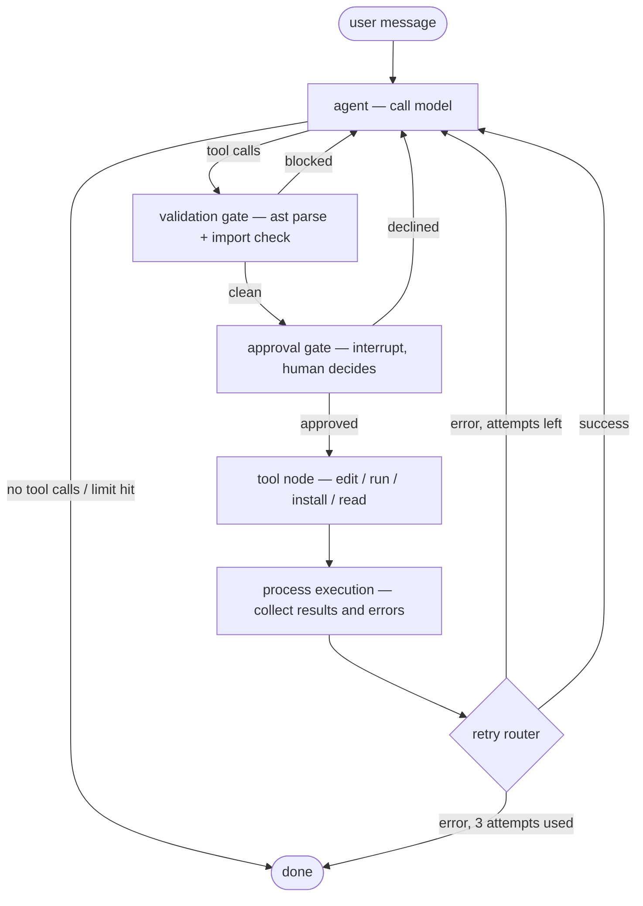

# CodeForge

<p align="center">
  <a href="https://github.com/Asem-Saber/Coding-Assistant/actions/workflows/ci.yml"></a>
  <a href="https://github.com/Asem-Saber/Coding-Assistant/actions/workflows/docker.yml"></a>
  <a href="https://github.com/Asem-Saber/Coding-Assistant/actions/workflows/integration.yml"></a>
  
  
</p>

A terminal coding agent that writes Python, validates it, and runs it inside a
disposable Docker container — never on your machine. Every file write and every
execution stops and waits for your approval first.

The agent has no path to your filesystem. It writes into a per-session workspace
directory, and that directory is the only thing bind-mounted into the sandbox
container it executes in. The container runs as a non-root user with all
capabilities dropped, `no-new-privileges`, a 512 MB memory cap, half a CPU, and a
60-second wall clock on every run.

Conversations are checkpointed to SQLite, so a session survives a crash or a
`Ctrl+D` — resume it by id and the agent picks up mid-approval if that's where it
stopped.

---

## Features

**Human-in-the-loop approval.** `edit_file` and `run_sandboxed_code` pause the
graph via LangGraph's `interrupt`. You see a unified diff for edits and the exact
command for runs, then approve or decline. A denial is recorded as a tool result,
so the agent learns it was refused and adapts instead of retrying blindly.
Anything unrecognized fails closed.

**Validation before execution.** A validation gate parses the saved file with
`ast` and resolves its imports against the sandbox interpreter before the tool
node ever runs. Syntax errors and missing modules are blocked with an
actionable message, and the whole tool batch is cancelled together.

**Isolated per-session sandboxes.** Each session owns one container and one
workspace directory. `safe_path` refuses any filename that escapes the session
root, so `../../etc/passwd` never resolves. Containers are torn down at exit and
stale ones are reclaimed by name.

**Automatic retry with a ceiling.** Failed runs route back to the model with the
stderr attached, up to 3 attempts, then the run stops and hands the problem back
to you.

**Budget guardrails.** Hard limits on turns (20), total tokens (100k), and
sandbox wall time (60s) — a runaway loop stops itself.

**Session persistence.** SQLite checkpointing per thread id. `--list` shows every
saved session and its files; `--session <id>` resumes one, including an approval
left hanging by an interrupted turn.

**Package installation on request.** `install_package` pip-installs into the
running sandbox after validating the package name. The base image already ships
numpy, pandas, matplotlib, requests, beautifulsoup4, scipy, scikit-learn, pillow,
tabulate, fastapi, httpx, and pytest.

**A real terminal UI.** Streaming tokens, syntax-highlighted code, diffs, clipped
output, and slash commands (`/help`, `/sessions`, `/files`, `/cost`, `/new`,
`/exit`). Rendering lives entirely in `src/ui` — the service layer emits plain
dataclass events, so an HTTP or web front end can consume the same stream.

---

## High-Level Architecture

Three layers, each unaware of the one above it:

| Layer | Package | Responsibility |
| --- | --- | --- |
| Presentation | `src/ui` | Renders events, prompts for approval. Swappable. |
| Service | `src/service` | Headless API over the graph: `send`, `resume`, `stats`, `files`. Emits typed events, no rendering. |
| Agent + sandbox | `src/agent`, `src/tools`, `src/sandbox` | The LangGraph state machine, its tools, and Docker lifecycle. |

The agent itself is a LangGraph state machine. A turn walks this path:



Two gates sit between the model and any side effect. The validation gate is
mechanical — it never asks, it just blocks bad code. The approval gate is the
human one; it calls `interrupt`, which suspends the graph and persists a
checkpoint. Resuming re-executes the node from the top, which is why it stays
free of side effects.

Execution never happens in the CodeForge process. `run_sandboxed_code` resolves
the filename inside the session workspace, then `exec_run`s it in that session's
container under `timeout 60`. When CodeForge is itself containerized,
`HOST_WORKSPACE_ROOT` rewrites the bind path so the host Docker daemon mounts the
right directory.

---

## Project Structure

```
CodeForge/
├── main.py                  REPL entrypoint: arg parsing, input loop, approval loop
├── src/
│   ├── config.py            Env, secrets-file loading, budgets, logging
│   ├── prompts.py           System prompt and its guardrails
│   ├── agent/
│   │   ├── graph.py         StateGraph wiring, SQLite checkpointer, compiled app
│   │   ├── nodes.py         Nodes and routers: model, gates, retry
│   │   └── state.py         AgentState TypedDict with reducers
│   ├── tools/
│   │   ├── file_ops.py      edit_file, list_directory, read_file_content
│   │   ├── execution.py     run_sandboxed_code
│   │   ├── packages.py      install_package
│   │   └── validation.py    validate_python_syntax, validate_imports
│   ├── sandbox/
│   │   ├── manager.py       Container lifecycle, one per session
│   │   └── paths.py         Session workspaces and path-escape guards
│   ├── service/
│   │   ├── session.py       Session: send / resume / stats / files / preview
│   │   └── events.py        Presentation-free event dataclasses
│   └── ui/
│       ├── console.py       Rich renderer: streaming, diffs, approval prompts
│       └── commands.py      Slash commands
├── sandbox/Dockerfile       The execution image (codeforge-sandbox)
├── Dockerfile               The app image
├── docker-compose.yaml      Both images, secrets, hardening
├── tests/                   Unit, integration (real Docker), and e2e suites
└── workspace/               Per-session working directories (gitignored)
```

---

## Quick Start

You need Docker either way — the sandbox is not optional. Build the sandbox image
before the first run:

```bash
docker build -t codeforge-sandbox ./sandbox
```

You also need an OpenAI-compatible endpoint and key. Any provider works;
`ENDPOINT` is the base URL and `MODEL_ID` the model name.

### Option A — Docker Compose

Put your keys in files rather than environment variables:

```bash
mkdir -p secrets && printf '%s' 'YOUR-API-KEY' > secrets/api_key && printf '%s' 'YOUR-LANGSMITH-KEY' > secrets/langsmith_api_key
```

Then edit `docker-compose.yaml` and replace the two absolute paths with your own
checkout — `HOST_WORKSPACE_ROOT` and the matching entry under `volumes:` both
point at `<your-repo>/workspace`. They must agree, because the host Docker daemon
resolves sandbox bind mounts against the host filesystem, not the app container's.
Adjust `MODEL_ID` and `ENDPOINT` in the same file while you're there.

```bash
docker compose run --rm codeforge
```

Compose builds `codeforge-sandbox` first, then starts the app read-only, with all
capabilities dropped, capped at 1 GB and 1 CPU. The Docker socket is mounted
read-only so the app can start sandboxes.

### Option B — Local development

```bash
git clone https://github.com/Asem-Saber/Coding-Assistant.git && cd Coding-Assistant
python -m venv .venv && source .venv/bin/activate   # Windows: .venv\Scripts\activate
pip install -e ".[dev]"
cp .env.example .env
```

Fill in `.env` with `API_KEY`, `ENDPOINT`, and `MODEL_ID`. The LangSmith variables
are optional — drop them to run without tracing.

```bash
python main.py
```

Useful invocations:

```bash
python main.py --list
```

```bash
python main.py --session <session-id>
```

Run the tests:

```bash
pytest -q
```

Integration and e2e tests that need a live Docker daemon and the
`codeforge-sandbox` image skip themselves automatically when either is missing.

---

## Tech Stack

| | |
| --- | --- |
| **Orchestration** | LangGraph 1.1 — `StateGraph`, `ToolNode`, `interrupt` for human-in-the-loop |
| **Model access** | LangChain + `langchain-openai` against any OpenAI-compatible endpoint |
| **Persistence** | `langgraph-checkpoint-sqlite` — one thread per session |
| **Isolation** | Docker SDK for Python; a hardened `python:3.12-slim` sandbox image |
| **Terminal UI** | Rich for rendering, prompt-toolkit for input history |
| **Config** | python-dotenv, with `*_FILE` indirection for Docker secrets |
| **Tests** | pytest, with `integration` and `e2e` markers |
| **CI** | GitHub Actions — 18-way matrix (3 OSes × 3 Pythons × pip/uv), image builds, live-sandbox integration |

Observability is optional: set the LangSmith variables and every run is traced.

---

## License

This project is licensed under the MIT License. See the [LICENSE](LICENSE) file for details.
